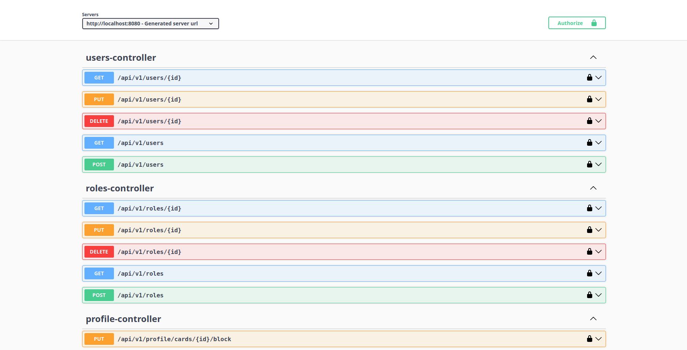

# 🚀 Система Управления Банковскими Картами

## 📁 Структура

Проект представляет собой **единый REST-сервис**:
Сервис имеет собственный `Dockerfile`, отдельные настройки, миграции БД, и свой набор тестов.
Общий `docker-compose` используется для развёртывания сервисов, включая инфраструктуру (PostgreSQL, Redis, Vault).


Разработано backend-приложение на Java (Spring Boot) для управления банковскими картами и переводами:

* **CRUD для карт, транзакций, ролей, юзеров и тд**
* **Переводы между своими и внешними картами**
* **Просмотр и фильтрация истории операций**
* **Просмотр и фильтрация юзеров, карт**
* **Изменение операций (при определённых условиях)**

## 💳 Атрибуты карты

* UUID идентификатор
* Номер карты — хранится в БД в зашифрованном виде (с помощью Vault), в открытом виде только последние 4 цифры
* Владелец (user\_id)
* Срок действия
* Статус: Активна, Заблокирована, Истек срок
* Баланс с признаком блокировки средств
* Привязанные данные: бренд, дата выпуска

### Аутентификация и авторизация

* **Spring Security + JWT**
* Redis для хранения refresh-токенов (поддержка logout)
* Подпись JWT планировалась через Vault, но реализована локально (из-за ошибки Vault)
* Роли:

    * `ADMIN` — полный доступ ко всем эндпоинтам
    * `USER` — доступ только к операциям со своими картами


**Администратор**:

* Создание, блокировка, активация, удаление карт
* Управление пользователями
* Просмотр всех карт и транзакций

**Пользователь**:

* Просмотр своих карт (с пагинацией и фильтрацией)
* Запрос на блокировку карты
* Переводы между своими и внешними картами
* Просмотр и фильтрация истории транзакций

### Безопасность

* Шифрование номера карты с помощью Hashicorp Vault
* Маскирование номеров на уровне БД (хранится только last4)
* Роли и доступы настроены через Spring Security
* Хранение refresh-токенов в Redis (для поддержки логаута и инвалидирования сессий)

### API

* REST CRUD для карт, транзакций, ролей, юзеров и тд
* Поддержка пагинации и фильтрации для списков
* Валидация входящих данных и понятные сообщения об ошибках

### 🗄️ Работа с БД

* PostgreSQL (схема и миграции через Liquibase)
* Индексы для оптимизации запросов
* Реализация **Outbox Pattern**:
    * Все события (например, транзакции) записываются в отдельную таблицу `outbox_events`
    * Планировщик (scheduler) регулярно читает события
    * В зависимости от типа события выполняется соответствующая бизнес-логика (например, обработка транзакции)

---

#### ✅ Механика транзакций

* Проверка статуса баланса (не заблокирован ли в другой операции)
* Проверка достаточности средств
* Атомарность операций через `@Transactional`
* Откат транзакций при ошибках
* Обработка транзакций через **outbox pattern + scheduler**

### Асинхронность и интеграция

* Outbox pattern используется для **локальной очереди (outbox таблица в БД)**
* Scheduler обрабатывает события, определяет их тип и выполняет соответствующие действия
* Redis используется для кэширования и управления сессиями(рефреш-токенами)

### Документация

* Swagger UI / OpenAPI спецификация в docs/openapi.yaml
* README.md с инструкцией запуска и описанием архитектуры

### Тестирование

* Unit тесты для ключевой бизнес-логики (покрытие \~40%)

### Развёртывание и разработка

* Docker Compose общий для запуска всех сервисов (БД, Redis, Vault, bank-rest)
* Отдельные docker-compose для разработки в IDE

### 💡 Технологии

* **Java 24**
* **Spring Boot 3.5.4**
* **Spring Security, Spring Data JPA, Spring Web**
* **PostgreSQL** + Liquibase
* **Vault** — шифрование номеров карт
* **Redis** — хранение refresh-токенов
* **Outbox Pattern + Scheduler** — обработка событий
* **JWT** — авторизация
* **Swagger / OpenAPI** — документация
* **Docker, Docker Compose**
---


## 🧪 Локальное тестирование

### 🚀 Запуск
Для локального тестирования необходимо поднять инфраструктуру:  

```bash
docker-compose -f bank-rest-app/docker-compose.yml up --build
````

После запуска вы можете использовать **Swagger UI** для проверки API:


---

### 📦 Мок-данные

Для удобства тестирования в проекте уже предзаполнена база с минимальным набором сущностей.

#### 👤 Пользователи

* **Администратор**

    * `username`: `admin`
    * `password`: `admin` (захэширован в БД, в тестах можно использовать как обычный пароль)
    * Роли: `ADMIN`, `USER`

#### 💳 Карты

| ID (UUID) | Номер карты (маскированный) | Последние 4 цифры | Статус  | Дата истечения | Баланс  | Заблокирован |
| --------- | --------------------------- | ----------------- | ------- | -------------- | ------- | ------------ |
| 1         | 4111 \*\*\*\* \*\*\*\* 1111 | 1111              | Active  | 2027-12-31     | 1500.50 | ❌            |
| 2         | 4111 \*\*\*\* \*\*\*\* 1112 | 1112              | Active  | 2027-12-31     | 120.50  | ❌            |
| 3         | 5500 \*\*\*\* \*\*\*\* 0004 | 0004              | Blocked | 2026-05-31     | 0.00    | ✅            |
| 4         | 3400 \*\*\*\* \*\*\* 0009   | 0009              | Expired | 2023-01-31     | 320.75  | ❌            |

#### 🏷️ Информация о картах

| Last4 | Бренд      | Дата выпуска |
| ----- | ---------- | ------------ |
| 1111  | VISA       | 2023-01-01   |
| 1112  | VISA       | 2023-01-02   |
| 0004  | MASTERCARD | 2022-06-01   |
| 0009  | AMEX       | 2020-01-01   |

---